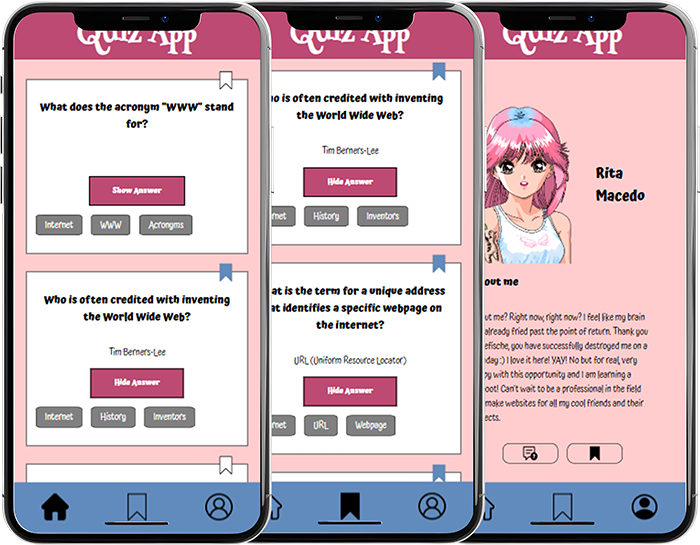

[![Contributors][contributors-shield]][contributors-url]
[![Stargazers][stars-shield]][stars-url]
[![Issues][issues-shield]][issues-url]
[![Unlicense License][license-shield]][license-url]
[![LinkedIn][linkedin-shield]][linkedin-url]

 

  

  <h2 align="center">⭐ Rita-QuizApp ⭐</h2>

  

    A mobile web application quiz about <i>The Internet</i>!
     
    <a href="https://ritakenji.github.io/rita-quizapp/">View Demo</a>
  

     

  
Table of Contents

  <ol>
    <li>
      <a href="#overview">Overview</a>
      <ul>
        <li><a href="#notes">Notes</a></li>
      </ul>
    </li>
    <li><a href="#features">Features</a></li>
    <li><a href="#learning-outcomes">Learning Outcomes</a></li>
    <li><a href="#technologies">Technologies</a></li>
    <li><a href="#acknowledgments">Acknowledgments</a></li>
  </ol>

 

<!-- ******************************************************** OVERVIEW *************************************************

Start with a clear, engaging title for your project. Write a brief summary explaining what the project is, its main purpose, and what someone can expect to find in the repository.

-->

<h2 id="overview">🌐 Overview</h2>

<a href="https://ritakenji.github.io/rita-quizapp/">Rita-quizapp</a> is an ongoing project created as part of the Web-Development Front-End bootcamp's Recap Projects at Neuefische. The main goal of this project is to apply all the learned material taught during the bootcamp's sessions.

In part 1, the task provided was simple: build the layout of a mobile web application, a quiz app, following the required design and behaviour specifications listed.

In part 2, we were tasked to create a whole new page and add interactability to some elements present in entire application.

  

(<a href="#readme-top">back to top</a>)

<h3 id="notes">📝 Notes</h3>

Part 1 of this project was creating the website's layout using only HTML and CSS. Part 2 was about implementing Javascript to add interactivity between elements.

❗Some changes may apply from time to time, as this project will be continuously edited throughout the bootcamp to optimize functionality, design and showcase new learning outcomes.❗

(<a href="#readme-top">back to top</a>)

<!-- ******************************************************** FEATURES *************************************************

 List the key functionalities and features of your application. What can a user do with it? Think of this as a bullet-point summary of your project's capabilities.

 -->

<h2 id="features">🧩 Features</h2>

The application is optimized for mobile screen, but responsive CSS design has been applied, meaning it can be viewed and interacted without any issues, from any size of device (mobile, tablet, laptop or desktop).

 

  

 

It consists of 4 pages:

- 🏠 **Home page**: Here, the user will have access to view all questions available on the platform.
  - Each card will have a question and upon clicking the button, the user unveils the correct answer. It is also possible to hide the answer once revealed, toggling back and forth;
  - By clicking on the bookmark icon, it is possible for the user to bookmark each question of their interest. <!--- which in the future part of the project will be stored in the _Bookmarks page_. --->
- 🔖 **Bookmarks page**: This is a exclusively dedicated space for the user to view the questions they've bookmarked on the homepage.
  <!---- Here the user may not just view, but also remove a card from their saved bookmark selection.--->
- ➕ **Add page**: On this page, the user can create new question cards.
  - These newly created question cards will be displayed on the Add page, below the form;
  - The main feature of this page is the form, consisting of 3 input areas and one button.
- 👤 **Profile page**: This section allows the user to view and manage their profile and settings.
  - '_About Me_' section displays the user's bio;
  - Present on this page are 2 _counters_ - number of questions created and number of saved bookmarks;
  - Last section is '_Settings_', which allows the user to toggle **Dark Mode**.

(<a href="#readme-top">back to top</a>)

<!-- ******************************************************** LEARNING OUTCOMES *************************************************

 This is a great section to highlight what you've learned. What new concepts did you apply? Did you master a new technology or design principle? This shows off the skills you've gained during the project.

 -->

<h2 id="learning-outcomes">🧠 Learning Outcomes</h2>

- Using correct **HTML semantics** to structure the page and make it more accessible to anyone visiting it;
- Learning how to correctly use the **BEM** method to classify the page's elements;
- Understanding the **CSS box-model**, **flexbox** and **positioning** principles to achieve a clean and **responsive design** that works seamlessly;
- **DOM** (Document Object Model) reading and manipulation.
- Combining HTML with JavaScript via **click**, **change** and **submit** events, in order to trigger actions that allow certain elements to change appearance and others to be created or even fully erased;
- All in all, integrating a wide set of JavaScript **statements**, **expressions**, **methods**, **functions**, and more to: <!-- , as well as data structures such as **arrays** and **objects**; -->
  - **Toggle** styling of elements, text values and **darkmode**;
  - **Submit forms**;
  - **Count** characters in **input fields**;
  - etc.

(<a href="#readme-top">back to top</a>)

<!-- ******************************************************** TECHNOLOGIES *************************************************

Clearly list all the programming languages and frameworks you used. It's a good idea to include visuals like skill icons to make this section stand out.

 -->

<h2 id="technologies">💻 Technologies</h2>

  
  
  

✨ JavaScript ✨ CSS ✨ HTML ✨

(<a href="#readme-top">back to top</a>)

<!-- ******************************************************** ACKNOWLEDGEMENTS *************************************************
 -->

<h2 id="acknowledgments">🏅 Acknowledgments</h2>

This space lists resources I found helpful in the creation and development of this project, to which I would like to give credit to.
I am sure anyone could make great use of them for their own projects, especially if just now starting their coding journey!

- [Choose an Open Source License](https://choosealicense.com)
- [GitHub Emoji Cheat Sheet](https://www.webpagefx.com/tools/emoji-cheat-sheet)
- [Malven's Flexbox Cheatsheet](https://flexbox.malven.co/)
- [Malven's Grid Cheatsheet](https://grid.malven.co/)
- [Img Shields](https://shields.io)
- [Othneildrewb's README template](https://github.com/othneildrew/Best-README-Template#readme)
- [Font Awesome](https://fontawesome.com)
- [Lucide Icons](https://lucide.dev/icons)
- [Icons 8](https://icons8.com/)
- [PageSpeed Insights](https://pagespeed.web.dev/)
- [Oh Shit Git](https://ohshitgit.com/)
- [Html-Css-Js](https://html-css-js.com/css/generator/box-shadow/)
- [Pokemon Palettes](http://pokepalettes.com/)
- [CSS Gradient](https://cssgradient.io/)
- [Get BEM](https://getbem.com/naming/)
- [CSS Tricks](https://css-tricks.com/guides/)
- [Web Active Learning Neuefisch](https://web-active-learning.vercel.app/documents/css-responsive)
- [Steve Ayo's Functions 101](https://www.steveayo.com/blog/function-declaration-function-expression-arrow-function/)

(<a href="#readme-top">back to top</a>)

<!-- MARKDOWN LINKS & IMAGES -->
<!-- https://www.markdownguide.org/basic-syntax/#reference-style-links -->

[contributors-shield]: https://img.shields.io/github/contributors/ritakenji/rita-quizapp.svg?style=for-the-badge
[contributors-url]: https://github.com/ritakenji/rita-quizapp/graphs/contributors
[stars-shield]: https://img.shields.io/github/stars/ritakenji/rita-quizapp.svg?style=for-the-badge
[stars-url]: https://github.com/ritakenji/rita-quizapp/stargazers
[issues-shield]: https://img.shields.io/github/issues/ritakenji/rita-quizapp.svg?style=for-the-badge
[issues-url]: https://github.com/ritakenji/rita-quizapp/issues
[license-shield]: https://img.shields.io/github/license/ritakenji/rita-quizapp.svg?style=for-the-badge
[license-url]: https://github.com/ritakenji/rita-quizapp/blob/master/LICENSE.txt
[linkedin-shield]: https://img.shields.io/badge/-LinkedIn-black.svg?style=for-the-badge&logo=linkedin&colorB=555
[linkedin-url]: https://www.linkedin.com/in/rita-macedo-557864103/
